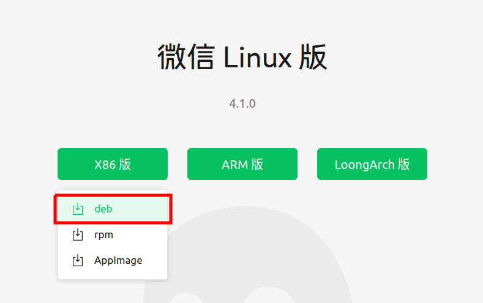
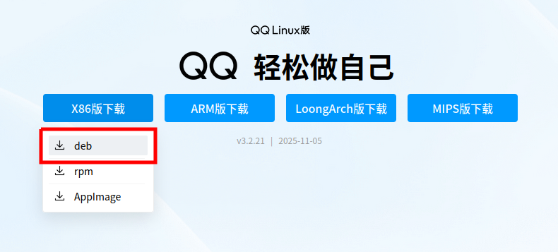

# UEE-Manual
ubuntu20.04常用APP，及针对云深处机器狗和云纵无人机的环境配置

## 目录
- [1 常用APP](#1-常用APP)
    - [1.1 ROS](#11-ros)
    - [1.2 Terminator(终端窗口分割器)](#12-terminator终端窗口分割器)
    - [1.3 VSCode](#13-vscode)
    - [1.4 向日葵](#14-向日葵)
    - [1.5 微信](#15-微信)
    - [1.6 QQ](#16-qq)
- [2 驱动安装](#2-驱动安装)
- [3 云深处机器狗环境配置](#3-云深处机器狗环境配置)
- [4 云纵无人机环境配置](#4-云纵无人机环境配置)

## 1 常用APP


### 1.1 ROS
#### 1.1.1 ROS Noetic版
**参考教程：** https://gitee.com/Mutil-Unmanned-System/mrs-tb3
- 鱼香一键安装ros，注意对应Ubuntu版本，ubuntu20对应Noetic
``` bash
    wget http://fishros.com/install -O fishros && . fishros
```
- 安装依赖项
``` bash
    sudo apt-get install ros-noetic-joy  ros-noetic-teleop-twist-keyboard ros-noetic-serial
```
---
### 1.2 Terminator(终端窗口分割器)
``` bash
    sudo apt update
    sudo apt install terminator
```
---
### 1.3 VSCode
#### 1.3.1 下载安装包
- 进入VSCode官网https://code.visualstudio.com/Download，下载Linux x64.deb版本

#### 1.3.2 安装软件包
``` bash
    sudo dpkg -i 包名.deb
```
#### 1.3.3 安装依赖
- C/C++
- Python
- Chinese (Simplified) (简体中文) Language Pack for Visual Studio
- ROS
- CMake Tools
- Markdown Preview Enhanced（readme.md编辑包）
---
### 1.4 向日葵
#### 1.4.1 下载安装包
- 进入向日葵官网https://sunlogin.oray.com/download，下载Linux x64.deb版本

#### 1.4.2 安装软件包
``` bash
    sudo dpkg -i 包名.deb
```
---
### 1.5 微信
#### 1.5.1 下载安装包
- 进入微信官网https://linux.weixin.qq.com，下载Linux x64.deb版本

#### 1.5.2 安装软件包
``` bash
    sudo dpkg -i 包名.deb
```
---
### 1.6 QQ
#### 1.6.1 下载安装包
- 进入QQ官网https://im.qq.com/linuxqq/index.shtml，下载Linux x64.deb版本

#### 1.6.2 安装软件包
``` bash
    sudo dpkg -i 包名.deb
```
---
## 2 驱动安装

### 2.1 显卡驱动安装
#### 2.1.1 更新系统
``` bash
    sudo apt update
    sudo apt upgrade
```
#### 2.1.2 安装编译工具
``` bash
    sudo apt install g++ gcc make
```
#### 2.1.3 禁用Nouveau驱动
- 打开黑名单配置文件
``` bash
    sudo nano /etc/modprobe.d/blacklist.conf
```
- 在文件末添加以下内容
``` text
    blacklist nouveau
    options nouveau modeset=0
```
- 更新initramfs并重启
``` bash
    sudo update-initramfs -u
    sudo reboot
```
- 验证禁用：重启后无输出表示成功
``` bash
    lsmod | grep nouveau
```
#### 2.1.4 安装NVIDIA驱动
- 添加PPA并安装驱动
``` bash
    sudo add-apt-repository ppa:graphics-drivers/ppa
    sudo apt update
    sudo apt install nvidia-driver-580-open 
    ##RTX 5050显卡需要NVIDIA开放内核模块（Open Kernel Modules），而不是传统的专有模块。
```
#### 2.1.5 重启系统验证安装
``` bash
    sudo reboot
    nvidia-smi
```
- 如出现以下信息则表示安装成功

---
## 3 云深处机器狗环境配置
---
## 4 云纵无人机环境配置
