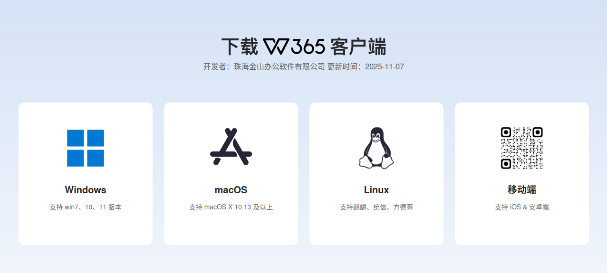
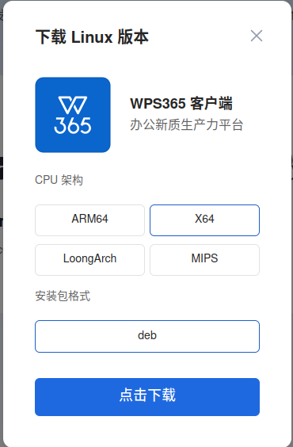
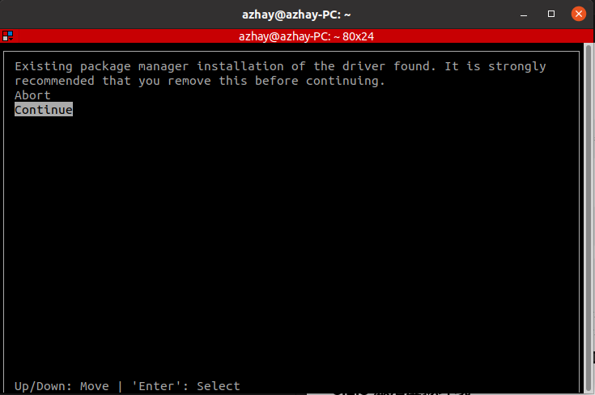
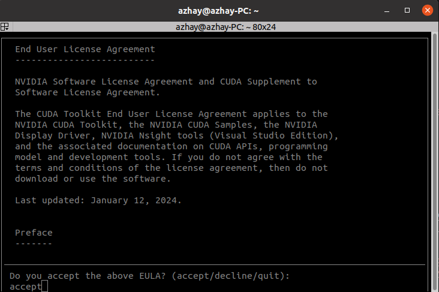
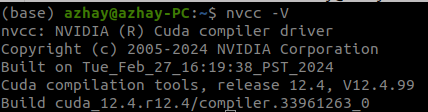
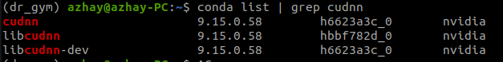

# UEE-Manual
ubuntu20.04常用APP，及针对云深处机器狗和云纵无人机的环境配置

## 目录
- [1 常用APP](#1-常用app)
    - [1.1 ROS](#11-ros)
    - [1.2 Terminator(终端窗口分割器)](#12-terminator终端窗口分割器)
    - [1.3 VSCode](#13-vscode)
    - [1.4 向日葵](#14-向日葵)
    - [1.5 微信](#15-微信)
    - [1.6 QQ](#16-qq)
    - [1.7 WPS](#17-wps)
- [2 驱动安装](#2-驱动安装)
    - [2.1 显卡驱动](#21-显卡驱动)
- [3 云深处机器狗环境配置](#3-云深处机器狗环境配置)
    - [3.1 Anaconda3](#31-anaconda3)
    - [3.2 安装虚拟环境](#32-安装虚拟环境)
    - [3.3 安装CUDA 12.4](#33-安装cuda-124)
    - [3.4 安装Isaac Gym](#34-安装isaac-gym)
- [4 云纵无人机环境配置](#4-云纵无人机环境配置)
    - [4.1 电脑系统配置](#41-电脑系统配置)
    - [4.2 安装ROS](#42-安装ros)
    - [4.3 安装PX4开发环境](#43-安装px4开发环境)
    - [4.4 安装Sunray项目依赖项](#44-安装sunray项目依赖项)
    - [4.5 安装编译Sunray项目](#45-安装编译sunray项目)
## 1 常用APP

### 1.1 ROS
#### 1.1.1 ROS Noetic版
**参考教程：** https://gitee.com/Mutil-Unmanned-System/mrs-tb3
- 鱼香一键安装ros，注意对应Ubuntu版本，ubuntu20对应Noetic
  ``` bash
  wget http://fishros.com/install -O fishros && . fishros
  ```
- 安装依赖项
  ``` bash
  sudo apt-get install ros-noetic-joy  ros-noetic-teleop-twist-keyboard ros-noetic-serial
  ```
---
### 1.2 Terminator(终端窗口分割器)
- 安装
  ``` bash
  sudo apt update
  sudo apt install terminator
  ```
---
### 1.3 VSCode
#### 1.3.1 下载安装包
- 进入VSCode官网https://code.visualstudio.com/Download ,下载Linux x64.deb版本

#### 1.3.2 安装软件包
- 安装
  ``` bash
  sudo dpkg -i 包名.deb
  ```
#### 1.3.3 安装依赖
- C/C++
- Python
- Chinese (Simplified) (简体中文) Language Pack for Visual Studio
- ROS
- CMake Tools
- Markdown Preview Enhanced（readme.md编辑包）
---
### 1.4 向日葵
#### 1.4.1 下载安装包
- 进入向日葵官网https://sunlogin.oray.com/download ，下载Linux x64.deb版本

#### 1.4.2 安装软件包
- 安装
  ``` bash
  sudo dpkg -i 包名.deb
  ```
---
### 1.5 微信
#### 1.5.1 下载安装包
- 进入微信官网https://linux.weixin.qq.com ，下载Linux x64.deb版本

#### 1.5.2 安装软件包
- 安装
  ``` bash
  sudo dpkg -i 包名.deb
  ```
---
### 1.6 QQ
#### 1.6.1 下载安装包
- 进入QQ官网https://im.qq.com/linuxqq/index.shtml ，下载Linux x64.deb版本

#### 1.6.2 安装软件包
- 安装
  ``` bash
  sudo dpkg -i 包名.deb
  ```
---
### 1.7 WPS
#### 1.7.1 下载安装包
- 进入WPS官网https://www.wps.cn/product/wpslinux ，下载Linux x64.deb版本

<div align=center></div>

#### 1.7.2 安装软件包
- 安装
  ``` bash
  sudo dpkg -i 包名.deb
  ```
---
## 2 驱动安装

### 2.1 显卡驱动
#### 2.1.1 更新系统
- 更新系统
  ``` bash
  sudo apt update
  sudo apt upgrade
  ```
#### 2.1.2 安装编译工具
- 安装编译工具
  ``` bash
  sudo apt install g++ gcc make
  ```
#### 2.1.3 禁用Nouveau驱动
- 打开黑名单配置文件
  ``` bash
  sudo nano /etc/modprobe.d/blacklist.conf
  ```
- 在文件末添加以下内容
  ``` text
  blacklist nouveau
  options nouveau modeset=0
  ```
- 更新initramfs并重启
  ``` bash
  sudo update-initramfs -u
  sudo reboot
  ```
- 验证禁用：重启后无输出表示成功
  ``` bash
  lsmod | grep nouveau
  ```
#### 2.1.4 安装NVIDIA驱动
- 添加PPA并安装驱动
  ``` bash
  sudo add-apt-repository ppa:graphics-drivers/ppa
  sudo apt update
  sudo apt install nvidia-driver-580-open 
  ##RTX 5050显卡需要NVIDIA开放内核模块（Open Kernel Modules），而不是传统的专有模块。
  ```
#### 2.1.5 重启系统验证安装
- 重启系统验证安装
  ``` bash
  sudo reboot
  nvidia-smi
  ```
- 如出现以下信息则表示安装成功

---
## 3 云深处机器狗环境配置

### 3.1 Anaconda3
**参考链接：** https://blog.csdn.net/wyf2017/article/details/118676765
#### 3.1.1 下载安装包
  ``` bash
  wget https://repo.anaconda.com/archive/Anaconda3-2025.06-0-Linux-x86_64.sh
  ```
#### 3.1.2 安装
  ``` bash
  chmod +x Anaconda3-2025.06-0-Linux-x86_64.sh
  ./Anaconda3-2025.06-0-Linux-x86_64.sh
  ```
#### 3.1.3 更新环境变量配置
``` bash
source ~/.bashrc
```
#### 3.1.4 验证安装
``` bash
(base) azhay@azhay-PC:~$ conda -V
conda 25.5.1
```
---
### 3.2 安装虚拟环境
#### 3.2.1 创建虚拟环境
``` bash
conda create -n dr_gym python=3.8 ##dr_gym为自定义环境名称
```
#### 3.2.2 验证创建
``` bash
conda env list
```
``` bash
# conda environments:                                                           
#                                                                               
base                 * /home/azhay/anaconda3                                    
dr_gym                 /home/azhay/anaconda3/envs/dr_gym
```
#### 3.2.3 激活虚拟环境
- 后续所有的操作都是在dr_gym 环境中
``` bash
conda activate dr_gym
```
---
### 3.3 安装CUDA 12.4
**参考链接1：** https://cloud.tencent.com/developer/article/2037551
**参考链接2：** https://blog.csdn.net/CC977/article/details/122789394
#### 3.3.1 安装CUDA
``` bash
wget https://developer.download.nvidia.com/compute/cuda/12.4.0/local_installers/cuda_12.4.0_550.54.14_linux.run
sudo sh cuda_12.4.0_550.54.14_linux.run
```
- 选择continue


- 输入accept


- 去掉安装显卡驱动的选项，选择install


#### 3.3.2 配置环境变量
- 打开环境变量配置文件
``` bash
gedit ~/.bashrc
```
- 在文件结尾输入以下语句
``` text
export PATH=/usr/local/cuda-12.4/bin${PATH:+:${PATH}}
export LD_LIBRARY_PATH=/usr/local/cuda-12.4/lib64${LD_LIBRARY_PATH:+:${LD_LIBRARY_PATH}}
export CUDA_HOME=/usr/local/cuda-12.4
```
- 更新环境变量配置
``` bash
source ~/.bashrc
```
#### 3.3.3 验证安装
``` bash
nvcc -V
```

#### 3.3.4 安装cuDNN
- 安装
``` bash
conda install nvidia::cudnn
```
- 验证安装
``` bash
conda list | grep cudnn
```
 

---
### 3.4 安装Isaac Gym
<font color="#FF0000">IsaacGym暂时可以不安装，50系显卡不支持</font>
<font color="#FF0000">3.4.3中的网络超时解决办法可以在pip安装中使用，命令格式：pip install 安装内容 -i 镜像源网址</font>
#### 3.4.1 下载安装包
- 在https://developer.nvidia.com/isaac-gym/download 网页下载安装文件IsaacGym_Preview_4_Package.tar.gz，下载后解压即可。
 
#### 3.4.2 激活虚拟环境
``` bash
conda activate dr_gym
```
#### 3.4.3 安装Python包及相关依赖
``` bash
cd isaacgym/python
pip install -e .
```
- 网络超时解决办法
``` bash
# 使用清华镜像源
pip install -e . -i https://pypi.tuna.tsinghua.edu.cn/simple --trusted-host pypi.tuna.tsinghua.edu.cn

# 或者使用阿里云镜像源
pip install -e . -i https://mirrors.aliyun.com/pypi/simple/ --trusted-host mirrors.aliyun.com

# 或者使用中科大镜像源
pip install -e . -i https://pypi.mirrors.ustc.edu.cn/simple/ --trusted-host pypi.mirrors.ustc.edu.cn
```
---
## 4 云纵无人机环境配置
**参考教程：** https://wiki.yundrone.cn/docs/Sunray-fang-zhen-kai-fa-huan-jing-pei-zhi
### 4.1 电脑系统配置
- 在电脑上安装Ubuntu20.04系统（安装方式三选一）
  - 安装ubuntu单系统或者ubuntu+windows双系统（推荐！）
  - 在windows中使用WSL的方式安装Ubuntu系统（一般推荐）
  - 在windows中使用虚拟机的方式安装Ubuntu系统（不推荐）
---
### 4.2 安装ROS
- 建议直接使用鱼香ROS的一键安装方式来安装ROS
  ``` bash
  wget http://fishros.com/install -O fishros && . fishros
  ```
- 安装完成之后通过roscore指令来确认是否正确安装ROS
  ``` bash
  roscore
  ```
---
### 4.3 安装PX4开发环境
#### 4.3.1 PX4源码配置
- 拉取px4仓库
  ``` bash
  git clone https://gitee.com/yundrone_sunray2023/sunray_px4.git
  ```
- 进入文件夹
  ``` bash
  cd sunray_px4
  ```
- 拉取子模块
  ``` bash
  git submodule update --init --recursive
  ```
- 安装依赖包 受网络原因肯能会失败多试几次
  ``` bash
  ./Tools/setup/ubuntu.sh
  ```
  > **<font color="#FF0000">报错：</font>**
  > 
  > 
  > **<font color="#FF0000">解决：</font>**
  > 这个错误是因为 requirements.txt 中的版本语法不正确。matplotlib>=3.0.* 这种写法在较新版本的 pip 中不被支持。让我们修复这个问题：
  > - 修复版本语法
  > ``` bash
  > sed -i 's/matplotlib>=3.0\.\*/matplotlib>=3.0/g' ~/sunray_px4/Tools/setup/requirements.txt
  > ```
  > - 进入文件夹
  > ``` bash
  > cd sunray_px4
  > ```
  > - 使用国内镜像源安装
  > ``` bash
  > pip3 install -i https://pypi.tuna.tsinghua.edu.cn/simple -r Tools/setup/requirements.txt
  > ```
- 编译仿真
  ``` bash
  make px4_sitl_default gazebo
  ```
  > **<font color="#FF0000">报错：</font>**
  > 
  > 
  > **<font color="#FF0000">解决：</font>**
  > 这个错误是因为上一步依赖包未安装全，再多安装几遍依赖
  > 或者是因为未退出conda虚拟环境
  > ``` bash
  > conda deactivate
  > pip3 install -i https://pypi.tuna.tsinghua.edu.cn/simple -r Tools/setup/requirements.txt
  > ```
#### 4.3.2 配置环境变量
- 打开环境变量配置文件
  ``` bash
  gedit ~/.bashrc
  ```
- 在文件结尾输入以下语句
  ``` text
  source ~/sunray_px4/Tools/simulation/gazebo-classic/setup_gazebo.bash ~/sunray_px4 ~/sunray_px4/build/px4_sitl_default
  export ROS_PACKAGE_PATH=$ROS_PACKAGE_PATH:~/sunray_px4/Tools/simulation/gazebo-classic/sitl_gazebo-classic
  export ROS_PACKAGE_PATH=$ROS_PACKAGE_PATH:~/sunray_px4
  ```
  > **<font color="#FF0000">报错：</font>**
  > 
  > 问题是重复路径，原因是执行px4的setup_gazebo.bash脚本输出了GAZEBO_PLUGIN_PATH、GAZEBO_MODEL_PATH、LD_LIBRARY_PATH三个路径，后续其他的脚本可能再次追加了相同的路径，最终导致了重复输出
  > 
  > 
  > **<font color="#FF0000">解决(不确定对后续的影响)：</font>**
  > ``` bash
  > # 去掉这行：
  > # source ~/sunray_px4/Tools/simulation/gazebo-classic/setup_gazebo.bash ~/sunray_px4 ~/sunray_px4/build/px4_sitl_default
  > 
  > # 改为手动设置：
  > export GAZEBO_PLUGIN_PATH=$GAZEBO_PLUGIN_PATH:~/sunray_px4/build/px4_sitl_default/build_gazebo-classic
  > export GAZEBO_MODEL_PATH=$GAZEBO_MODEL_PATH:~/sunray_px4/Tools/simulation/gazebo-classic/sitl_gazebo-classic/models
  > export LD_LIBRARY_PATH=$LD_LIBRARY_PATH:~/sunray_px4/build/px4_sitl_default/build_gazebo-classic
  > ```
#### 4.3.3 安装MAVROS
- 使用二进制方式安装
  ``` bash
  sudo apt-get install ros-noetic-mavros*
  ```
- 安装GeographicLib (mavros的依赖库)
  ``` bash
  sudo /opt/ros/noetic/lib/mavros/install_geographiclib_datasets.sh
  ```
  * 这一步由于网络问题，安装时间会比较长，请耐心等待
  * 如果安装失败，可参考如下教程[install_geographiclib_datasets.sh](https://blog.csdn.net/weixin_41865104/article/details/119418901)
---
### 4.4 安装Sunray项目依赖项
- 安装VRPN，用于真机试验中获取动捕数据
  ``` bash
  sudo apt-get install ros-noetic-vrpn
  ```
---
### 4.5 安装编译Sunray项目
- 下载代码
  ``` bash
  git clone https://github.com/YunDrone-Team/Sunray.git
  ```
- 编译代码
  ``` bash
  cd Sunray
  ## 编译
  ./build.sh
  ```
  > 全选所有模块并开始编译构建
  > 
  > 
  > **<font color="#FF0000">报错：</font>**
  > 
  > 
  > **<font color="#FF0000">1.解决sunray_detection构建失败：</font>**
  > 硬件需要，仿真不需要，可以先忽略该报错
  > **硬件环境下：**
  > 方案1：安装 RKNN Toolkit（如果你有 Rockchip 设备）
  > ``` bash
  > ## 创建第三方库目录
  > mkdir -p ~/libs
  > cd ~/libs
  > 
  > # 下载 RKNN Toolkit（需要从官方获取）
  > # 由于版权原因，需要从 Rockchip 官网下载
  > # 或者使用 wget 下载（如果知道下载链接）
  > wget https://github.com/rockchip-linux/rknn-toolkit2/archive/refs/tags/v1.5.2.tar.gz
  > 
  > # 解压并安装
  > tar -xzf rknn-toolkit2-*.tar.gz
  > cd rknn-toolkit2-*
  > 
  > # 安装 Python 包
  > pip3 install -r requirements.txt
  > pip3 install .
  > 
  > # 设置头文件路径
  > export RKNN_API_PATH=~/libs/rknn-toolkit2-*/runtime/RKNN-RT2/rknn-api/include
  > ```
  > **仿真环境下：**
  > 方案2：临时注释掉 NPU 相关代码
  > ``` bash
  > cd /home/zq/Sunray/External_Module/sunray_detection
  > 
  > # 备份文件
  > cp detection_libs/src/inference_backend/npu/rknn/rknn_runner.h detection_libs/src/inference_backend/npu/rknn/rknn_runner.h.bak
  > 
  > # 在文件开头添加禁用宏
  > echo -e "#ifndef DISABLE_NPU\n#define DISABLE_NPU\n#endif\n\n$(cat detection_libs/src/inference_backend/npu/rknn/rknn_runner.h)" > detection_libs/src/inference_backend/npu/rknn/rknn_runner.h
  > ```
  > 
  > **<font color="#FF0000">2.解决sunray_formation构建失败：</font>**
  > ``` bash
  > sudo apt-get install -y \
  >   libsfml-dev \
  >   libsfml-system2.5 \
  >   libsfml-window2.5 \
  >   libsfml-graphics2.5 \
  >   libsfml-audio2.5 \
  >   libsfml-network2.5
  > ```
- 写入环境变量
  ``` bash
  ## 打开环境变量文件
  gedit ~/.bashrc
  ## 写入环境变量
  source ~/Sunray/devel/setup.bash
  export GAZEBO_MODEL_PATH=$GAZEBO_MODEL_PATH:~/Sunray/Simulation/sunray_simulator/models
  export GAZEBO_MODEL_PATH=$GAZEBO_MODEL_PATH:~/Sunray/Simulation/sunray_simulator/models/scence_models
  export GAZEBO_MODEL_PATH=$GAZEBO_MODEL_PATH:~/Sunray/Simulation/sunray_simulator/models/sensor_models
  export GAZEBO_MODEL_PATH=$GAZEBO_MODEL_PATH:~/Sunray/Simulation/sunray_simulator/models/drone_models
  export GAZEBO_MODEL_PATH=$GAZEBO_MODEL_PATH:~/Sunray/Simulation/sunray_simulator/models/world_models
  export GAZEBO_MODEL_PATH=$GAZEBO_MODEL_PATH:~/Sunray/Simulation/sunray_simulator/models/ugv_models
  export GAZEBO_MODEL_PATH=$GAZEBO_MODEL_PATH:~/Sunray/Simulation/sunray_simulator/texture
  ## 刷新环境变量
  source ~/.bashrc
  ## 为了确认你的包路径已经设置，回显 ROS_PACKAGE_PATH 变量
  echo $ROS_PACKAGE_PATH
  ```
- 编译后运行以下指令确认安装成功
  ``` bash
  roslaunch sunray_simulator sunray_sim_1uav.launch
  ```
  > **<font color="#FF0000">报错1：</font>**
  > 
  > 
  > **<font color="#FF0000">解决1：</font>**
  > 这个错误是因为sunray_px4和Sunray环境配置路径顺序错误
  > ``` bash
  > ## 错误顺序：先完整设置 PX4 环境（source + export），然后设置 Sunray 环境（source + export）
  > source ~/sunray_px4/Tools/simulation/gazebo-classic/setup_gazebo.bash ~/sunray_px4 ~/sunray_px4/build/px4_sitl_default
  > export ROS_PACKAGE_PATH=$ROS_PACKAGE_PATH:~/sunray_px4/Tools/simulation/gazebo-classic/sitl_gazebo-classic
  > export ROS_PACKAGE_PATH=$ROS_PACKAGE_PATH:~/sunray_px4
  > 
  > source ~/Sunray/devel/setup.bash
  > export GAZEBO_MODEL_PATH=$GAZEBO_MODEL_PATH:~/Sunray/Simulation/sunray_simulator/models
  > export GAZEBO_MODEL_PATH=$GAZEBO_MODEL_PATH:~/Sunray/Simulation/sunray_simulator/models/scence_models
  > export GAZEBO_MODEL_PATH=$GAZEBO_MODEL_PATH:~/Sunray/Simulation/sunray_simulator/models/sensor_models
  > export GAZEBO_MODEL_PATH=$GAZEBO_MODEL_PATH:~/Sunray/Simulation/sunray_simulator/models/drone_models
  > export GAZEBO_MODEL_PATH=$GAZEBO_MODEL_PATH:~/Sunray/Simulation/sunray_simulator/models/world_models
  > export GAZEBO_MODEL_PATH=$GAZEBO_MODEL_PATH:~/Sunray/Simulation/sunray_simulator/models/ugv_models
  > export GAZEBO_MODEL_PATH=$GAZEBO_MODEL_PATH:~/Sunray/Simulation/sunray_simulator/texture
  > ```
  > ``` bash
  > ## 正确顺序：先初始化所有框架，后配置具体路径
  > source ~/sunray_px4/Tools/simulation/gazebo-classic/setup_gazebo.bash ~/sunray_px4 ~/sunray_px4/build/px4_sitl_default
  > source ~/Sunray/devel/setup.bash
  > 
  > export ROS_PACKAGE_PATH=$ROS_PACKAGE_PATH:~/sunray_px4/Tools/simulation/gazebo-classic/sitl_gazebo-classic
  > export ROS_PACKAGE_PATH=$ROS_PACKAGE_PATH:~/sunray_px4
  > 
  > export GAZEBO_MODEL_PATH=$GAZEBO_MODEL_PATH:~/Sunray/Simulation/sunray_simulator/models
  > export GAZEBO_MODEL_PATH=$GAZEBO_MODEL_PATH:~/Sunray/Simulation/sunray_simulator/models/scence_models
  > export GAZEBO_MODEL_PATH=$GAZEBO_MODEL_PATH:~/Sunray/Simulation/sunray_simulator/models/sensor_models
  > export GAZEBO_MODEL_PATH=$GAZEBO_MODEL_PATH:~/Sunray/Simulation/sunray_simulator/models/drone_models
  > export GAZEBO_MODEL_PATH=$GAZEBO_MODEL_PATH:~/Sunray/Simulation/sunray_simulator/models/world_models
  > export GAZEBO_MODEL_PATH=$GAZEBO_MODEL_PATH:~/Sunray/Simulation/sunray_simulator/models/ugv_models
  > export GAZEBO_MODEL_PATH=$GAZEBO_MODEL_PATH:~/Sunray/Simulation/sunray_simulator/texture
  > ```
  > 
  > **<font color="#FF0000">报错2：</font>**
  > 
  > 
  > 
  > **<font color="#FF0000">解决2：</font>**
  > 这个错误是因为在conda虚拟环境下的ROS Python包未安装
  > ``` bash
  > ## 可以通过退出conda环境再运行(更建议)
  > conda deactivate
  > roslaunch sunray_simulator sunray_sim_1uav.launch
  > ```
  > ``` bash
  > ## 或者在conda环境下安装ROS Python包,再运行
  > conda activate base ## base为自定义环境名词
  > pip install rospkg catkin-pkg empy defusedxml
  > roslaunch sunray_simulator sunray_sim_1uav.launch
  > ```
---
